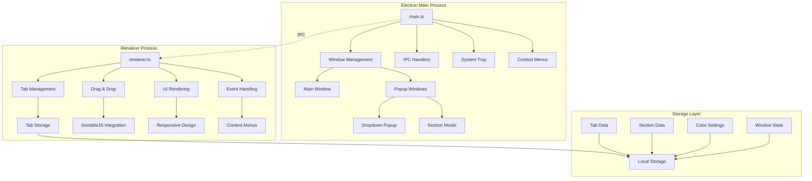

# Design Document

## Overview

The Chrome Vertical Tab Bar is a sophisticated Electron-based desktop application that provides a vertical tab management interface for Windows users. The application features a modern glass morphism design with responsive layouts, drag-and-drop functionality, section-based organization, and advanced visual effects. The architecture follows a clean separation between the main Electron process and the renderer process, with comprehensive state management and persistence.

## Architecture

### High-Level Architecture



### Process Communication

The application uses Electron's IPC (Inter-Process Communication) for secure communication between the main and renderer processes:

- **Main → Renderer**: Window events, dropdown actions, section modal results
- **Renderer → Main**: Window controls, popup requests, context menu triggers
- **Bidirectional**: Tab management operations, system integration events

## Components and Interfaces

### Core Components

#### 1. Main Process Components

**WindowManager**
- Manages main application window lifecycle
- Handles window positioning, sizing, and state
- Coordinates popup window creation and management
- Implements responsive window controls

**PopupManager**
- Creates and manages dropdown popup windows
- Handles section modal dialogs
- Implements glass morphism effects in popups
- Manages popup positioning and auto-close behavior

**SystemIntegration**
- Provides system tray functionality
- Handles context menu creation and events
- Manages application lifecycle and auto-start
- Implements silent launch capabilities

#### 2. Renderer Process Components

**TabManager**
- Core tab data structure and operations
- Tab creation, deletion, and modification
- URL validation and favicon fetching
- Tab persistence and restoration

**SectionManager**
- Section creation and management
- Color assignment and persistence
- Section reordering and deletion
- Empty section handling

**DragDropController**
- SortableJS integration and configuration
- Drag state management and visual feedback
- Cross-section tab movement
- Drag operation cleanup and error recovery

**ResponsiveLayoutManager**
- Window width detection and mode switching
- Dynamic UI element sizing and positioning
- Hamburger menu vs. full layout switching
- Window control button adaptation

**UIRenderer**
- DOM manipulation and element creation
- Theme management (dark/light mode)
- Visual effect application (glass morphism)
- Animation and transition coordination

### Data Interfaces

#### Tab Interface
```typescript
interface Tab {
    id: string;           // Unique identifier
    url: string;          // Target URL
    title: string;        // Display title
    favicon: string;      // Favicon URL
    section?: string;     // Optional section assignment
    pinned?: boolean;     // Pin status
    order?: number;       // Display order
}
```

#### Section Interface
```typescript
interface Section {
    name: string;         // Section name
    color?: string;       // Optional color assignment
    order: number;        // Display order
    collapsed?: boolean;  // Collapse state
}
```

#### SectionColors Interface
```typescript
interface SectionColors {
    [sectionName: string]: string;  // Color name mapping
}
```

#### WindowState Interface
```typescript
interface WindowState {
    width: number;        // Window width
    height: number;       // Window height
    x: number;           // Window X position
    y: number;           // Window Y position
    theme: 'light' | 'dark';  // Theme preference
}
```

## Data Models

### Storage Architecture

The application uses browser localStorage for data persistence with the following structure:

#### Primary Storage Keys
- `tabs`: Array of Tab objects
- `sections`: Array of section names
- `sectionColors`: SectionColors object mapping
- `tabBarWidth`: Current window width
- `theme`: Current theme setting
- `windowPosition`: Window position data

#### Data Validation and Migration
- JSON schema validation for stored data
- Automatic data migration for version updates
- Fallback mechanisms for corrupted data
- Regular data integrity checks

### Favicon Management System

The application implements a sophisticated favicon fetching system with multiple fallback strategies:

1. **HTML Parsing**: Extract favicon links from webpage HTML
2. **Direct Path Testing**: Try common favicon paths on the domain
3. **Favicon Kit API**: Use external favicon service
4. **Clearbit Logo API**: Fetch company logos
5. **DuckDuckGo Fallback**: Final fallback service

## Error Handling

### Error Categories and Strategies

#### 1. Network Errors
- **Favicon Fetching**: Multiple fallback services with timeout handling
- **URL Validation**: Client-side validation with user feedback
- **Service Unavailability**: Graceful degradation with cached data

#### 2. Drag Operation Errors
- **Stuck Drag States**: Automatic cleanup on window blur/focus
- **Invalid Drop Targets**: Visual feedback and state reset
- **Interrupted Operations**: ESC key and mouse event cleanup

#### 3. Storage Errors
- **localStorage Failures**: Error logging with fallback to memory storage
- **Data Corruption**: Automatic data validation and repair
- **Quota Exceeded**: Data cleanup and user notification

#### 4. Window Management Errors
- **Popup Creation Failures**: Fallback to inline modals
- **Positioning Errors**: Automatic repositioning within screen bounds
- **System Integration Failures**: Graceful degradation without tray

### Error Recovery Mechanisms

```typescript
// Example error recovery pattern
function withErrorRecovery<T>(operation: () => T, fallback: () => T): T {
    try {
        return operation();
    } catch (error) {
        console.error('Operation failed:', error);
        return fallback();
    }
}
```

## Testing Strategy

### Unit Testing Approach

#### 1. Component Testing
- **Tab Management**: CRUD operations, validation, persistence
- **Section Management**: Creation, deletion, color assignment
- **Drag & Drop**: State management, visual feedback, cleanup
- **Responsive Design**: Layout switching, element sizing

#### 2. Integration Testing
- **IPC Communication**: Main-renderer message passing
- **Storage Operations**: Data persistence and retrieval
- **Window Management**: Popup creation and positioning
- **System Integration**: Tray functionality, context menus

#### 3. End-to-End Testing
- **User Workflows**: Complete tab management scenarios
- **Responsive Behavior**: Window resizing and layout adaptation
- **Error Scenarios**: Network failures, invalid inputs
- **Performance**: Large tab collections, memory usage

### Testing Framework Integration

```typescript
// Example test structure
describe('TabManager', () => {
    beforeEach(() => {
        // Setup test environment
        localStorage.clear();
        initializeTestDOM();
    });

    it('should create tab with valid favicon', async () => {
        const tab = await createTab('https://example.com');
        expect(tab.favicon).toBeDefined();
        expect(tab.id).toBeDefined();
    });

    it('should handle favicon fetch failures gracefully', async () => {
        const tab = await createTab('https://invalid-domain.test');
        expect(tab.favicon).toContain('duckduckgo.com');
    });
});
```

### Performance Testing

#### 1. Memory Management
- Tab collection scaling (100+ tabs)
- DOM element cleanup during operations
- Event listener management
- Storage usage optimization

#### 2. Rendering Performance
- Drag operation smoothness
- Responsive layout transitions
- Animation frame rate consistency
- Large section rendering

#### 3. Startup Performance
- Application launch time
- Data restoration speed
- Initial render performance
- System integration setup

## Security Considerations

### Content Security Policy
The application implements a strict CSP to prevent XSS attacks:
- Script sources limited to self and trusted CDNs
- Image sources allow favicon fetching from external domains
- Style sources allow inline styles for dynamic theming

### Data Sanitization
- URL validation before storage and display
- HTML escaping for user-generated content
- Input validation for section names and tab titles

### External Resource Handling
- Favicon fetching with timeout limits
- CORS-aware external API usage
- Fallback mechanisms for service failures

## Responsive Design Implementation

### Breakpoint Strategy

#### Narrow Mode (≤140px)
- Hamburger menu for section actions
- Compressed window controls (32px total width)
- Two-column tab layout
- Simplified visual elements

#### Wide Mode (>140px)
- Full section action visibility
- Standard window controls (42px total width)
- Multi-column tab layout
- Enhanced visual effects

### Dynamic Element Sizing

```css
/* Example responsive implementation */
.window-control-btn {
    width: 16px;
    height: 14px;
    transition: all 0.3s ease;
}

.window-control-btn.narrow {
    width: 14px;
    height: 12px;
}
```

### Layout Adaptation Logic

The responsive system monitors window width changes and triggers layout updates:
1. Width detection and mode determination
2. Element class updates for styling changes
3. Layout recalculation and re-rendering
4. Animation coordination for smooth transitions

## Glass Morphism Implementation

### Visual Effect Stack
1. **Backdrop Filter**: 50px blur for glass effect
2. **Background Opacity**: Semi-transparent backgrounds
3. **Border Enhancement**: Subtle borders for definition
4. **Shadow Effects**: Depth perception with box-shadows

### Performance Optimization
- Hardware acceleration for backdrop filters
- Selective application to minimize performance impact
- Fallback styles for unsupported browsers
- Animation optimization with transform properties

## Theme System Architecture

### CSS Custom Properties
The theme system uses CSS custom properties for consistent theming:

```css
:root {
    --bg-color: #f8f9fa;
    --text-color: #333333;
    --tab-bg: #f0f0f0;
    /* ... additional properties */
}

[data-theme="dark"] {
    --bg-color: #2e2e2e;
    --text-color: #ffffff;
    --tab-bg: #404040;
    /* ... dark theme overrides */
}
```

### Theme Switching Logic
1. Theme state persistence in localStorage
2. DOM attribute updates for theme switching
3. Smooth transitions between themes
4. Component-specific theme adaptations